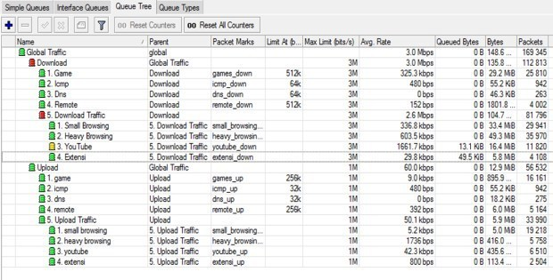

# Mikrotik-Queue-Tree-Traffic-Priority

Untuk pengguna MikroTik yang ingin melakukan management bandwidth baik di warnet, hotspot, kantor, kost-kostan atau di warung wifi
limit bandwidth dengan mode Queue Tree di MikroTik routerOS.

Queue Tree yang dibuat ini system nya bagi sama rata bandwidth untuk semua pengguna tapi melakukan priority (prioritas) untuk browsing dan game. Sehingga pengguna yang sedang online game dan melakukan browsing tidak terganggu oleh aktifitas pengguna yang sedang download atau streaming youtube.

Silahkan copy semua script kemudian anda paste terlebih dulu ke text editor seperti notepad++, kemudian sesuaikan nama interface nya.

> ether1 – Wan = adalah nama interface ether1 mikrotik
 ether2 – Lan = adalah nama interface ether2 mikrotik

Jika semua sudah di sesuaikan, silahkan copy semua kemudian paste ke terminal winbox.

#### Penjelasan Script Mangle Queue Tree

>/ip firewall address-list
add address=192.168.0.0/16 list=private_IPv4
add address=172.16.0.0/12 list=private_IPv4
add address=10.0.0.0/8 list=private_IPv4  
**Membuat address-list ke mikrotik dengan nama “private_IPv4” berisi semua private IP, jika di jaringan anda terdapat ip lokal di luar ip private di atas silahkan anda tambahkan.**

>/ip firewall layer7-protocol
add name=EXE regexp="\\x4d\\x5a(\\x90\\x03|\\x50\\x02)\\x04"
add name=ZIP regexp="pk\\x03\\x04\\x14"
add name=MP4 regexp="\\x18\\x66\\x74\\x79\\x70"
add name=RAR regexp="Rar\\x21\\x1a\\x07"
add name=youtube regexp="r[0-9]+---[a-z]+-+[a-z0-9-]+\\.googlevideo\\.com"  
**Memasukan Regex Layer7 Youtube dan Layer7 extensi EXE, ZIP, MP4, dan RAR.**
Jika anda ingin menambah Layer7 untuk extensi yang lain, silahkan tinggal di input saja.

>/ip firewall mangle
add action=accept chain=prerouting comment="Bypass Local Traffic" dst-address-list=private_IPv4 src-address-list=private_IPv4
add action=accept chain=forward dst-address-list=private_IPv4 src-address-list=private_IPv4  
**Bypass local Traffic, tujuannya adalah agar traffic dari lokal menuju lokal lagi tidak terlimit.**

>add action=mark-connection chain=forward comment="Games Traffic" dst-port=39190-39200 new-connection-mark=games passthrough=yes protocol=tcp src-address-list=private_IPv4
add action=mark-connection chain=forward dst-port=40000-40010 new-connection-mark=games passthrough=yes protocol=udp src-address-list=private_IPv4
add action=mark-packet chain=forward connection-mark=games in-interface="ether1 - Wan" new-packet-mark=games_down passthrough=no
add action=mark-packet chain=forward connection-mark=games in-interface="ether2 - Lan" new-packet-mark=games_up passthrough=no  
**Menandai Traffic Game online berdasarkan port untuk kita pisahkan queue nya nanti. Script di atas saya hanya buatkan contoh pada game PB, silahkan anda tambahkan sendiri.**

>add action=mark-connection chain=forward comment="ICMP Traffic" new-connection-mark=icmp passthrough=yes protocol=icmp src-address-list=private_IPv4
add action=mark-packet chain=forward connection-mark=icmp in-interface="ether1 - Wan" new-packet-mark=icmp_down passthrough=no protocol=icmp
add action=mark-packet chain=forward connection-mark=icmp in-interface="ether2 - Lan" new-packet-mark=icmp_up passthrough=no protocol=icmp
add action=mark-connection chain=forward comment="DNS Traffic" dst-port=53 new-connection-mark=dns passthrough=yes protocol=udp src-address-list=private_IPv4
add action=mark-packet chain=forward connection-mark=dns in-interface="ether1 - Wan" new-packet-mark=dns_down passthrough=no protocol=udp
add action=mark-packet chain=forward connection-mark=dns in-interface="ether2 - Lan" new-packet-mark=dns_up passthrough=no protocol=udp
add action=mark-connection chain=forward comment="Remote Traffic" dst-port=22,23,8291,5938,4899 new-connection-mark=remote passthrough=yes protocol=tcp src-address-list=private_IPv4
add action=mark-packet chain=forward connection-mark=remote in-interface="ether1 - Wan" new-packet-mark=remote_down passthrough=no
add action=mark-packet chain=forward connection-mark=remote in-interface="ether2 - Lan" new-packet-mark=remote_up passthrough=no  
**Menandai / marking traffic DNS, ICMP dan beberapa port seperti SSH, dan winbox.**

>add action=mark-connection chain=forward comment="YouTube Traffic" layer7-protocol=youtube new-connection-mark=youtube passthrough=yes src-address-list=private_IPv4
add action=mark-packet chain=forward connection-mark=youtube in-interface="ether1 - Wan" new-packet-mark=youtube_down passthrough=no
add action=mark-packet chain=forward connection-mark=youtube in-interface="ether2 - Lan" new-packet-mark=youtube_up passthrough=no
add action=mark-connection chain=forward comment="Extension Layer7" layer7-protocol=EXE new-connection-mark=extensi passthrough=yes
add action=mark-connection chain=forward layer7-protocol=ZIP new-connection-mark=extensi passthrough=yes
add action=mark-connection chain=forward layer7-protocol=MP3 new-connection-mark=extensi passthrough=yes
add action=mark-connection chain=forward layer7-protocol=RAR new-connection-mark=extensi passthrough=yes
add action=mark-packet chain=forward connection-mark=extensi in-interface="ether1 - Wan" new-packet-mark=extensi_down passthrough=no
add action=mark-packet chain=forward connection-mark=extensi in-interface="ether2 - Lan" new-packet-mark=extensi_up passthrough=no  
**Menandai / marking traffic YouTube dan Extensi berdasarkan layer7 yang sudah kita buat di awal, jika anda sudah menambahkan layer7, silahkan anda tambahkan juga mangle nya seperti di atas.**

>add action=mark-connection chain=forward comment="Browsing Traffic" connection-mark=!heavy_traffic new-connection-mark=browsing passthrough=yes src-address-list=private_IPv4
add action=mark-connection chain=forward comment="Heavy Traffic" connection-bytes=1024000-0 connection-mark=browsing connection-rate=256k-102400k new-connection-mark=heavy_traffic passthrough=yes protocol=tcp
add action=mark-connection chain=forward connection-bytes=1024000-0 connection-mark=browsing connection-rate=256k-102400k new-connection-mark=heavy_traffic passthrough=yes protocol=udp
add action=mark-packet chain=forward connection-mark=heavy_traffic in-interface="ether1 - Wan" new-packet-mark=heavy_browsing_down passthrough=no
add action=mark-packet chain=forward connection-mark=heavy_traffic in-interface="ether2 - Lan" new-packet-mark=heavy_browsing_up passthrough=no
add action=mark-packet chain=forward connection-mark=browsing in-interface="ether1 - Wan" new-packet-mark=small_browsing_down passthrough=no
add action=mark-packet chain=forward connection-mark=browsing in-interface="ether2 - Lan" new-packet-mark=small_browsing_up passthrough=no  
**Mangle terakhir di atas tujuannya memisahkan traffic browsing yang ringan dan berat, jika seseorang melakukan browsing dan sudah mencapai 1 Mb page yang sudah di buka tapi masih membutuhkan kecepatan di atas 256k, maka traffic tersebut di tandai sebagai “heavy traffic”.**

## Queue Tree HTB

>/queue type
add kind=pcq name=down_pcq pcq-classifier=dst-address pcq-dst-address6-mask=64 pcq-src-address6-mask=64
add kind=pcq name=up_pcq pcq-classifier=src-address pcq-dst-address6-mask=64 pcq-src-address6-mask=64
/queue tree
add name="Global Traffic" parent=global queue=default
add max-limit=3M name=Download parent="Global Traffic" queue=default
add max-limit=1M name=Upload parent="Global Traffic"
add limit-at=512k max-limit=3M name="1. Game" packet-mark=games_down parent=Download priority=1 queue=down_pcq
add limit-at=64k max-limit=3M name="2. Icmp" packet-mark=icmp_down parent=Download priority=1 queue=down_pcq
add limit-at=64k max-limit=3M name="3. Dns" packet-mark=dns_down parent=Download priority=1 queue=down_pcq
add max-limit=3M name="5. Download Traffic" parent=Download queue=default
add max-limit=3M name="1. Small Browsing" packet-mark=small_browsing_down parent="5. Download Traffic" priority=5 queue=down_pcq
add max-limit=3M name="2. Heavy Browsing" packet-mark=heavy_browsing_down parent="5. Download Traffic" priority=7 queue=down_pcq
add limit-at=512k max-limit=3M name="4. Remote" packet-mark=remote_down parent=Download priority=3 queue=down_pcq
add max-limit=3M name="3. YouTube" packet-mark=youtube_down parent="5. Download Traffic" priority=7 queue=down_pcq
add max-limit=3M name="4. Extensi" packet-mark=extensi_down parent="5. Download Traffic" queue=down_pcq
add limit-at=256k max-limit=1M name="1. game" packet-mark=games_up parent=Upload priority=1 queue=up_pcq
add limit-at=32k max-limit=1M name="2. icmp" packet-mark=icmp_up parent=Upload priority=1 queue=up_pcq
add limit-at=32k max-limit=1M name="3. dns" packet-mark=dns_up parent=Upload priority=1 queue=up_pcq
add limit-at=256k max-limit=1M name="4. remote" packet-mark=remote_up parent=Upload priority=3 queue=up_pcq
add max-limit=1M name="5. Upload Traffic" parent=Upload queue=default
add max-limit=1M name="1. small browsing" packet-mark=small_browsing_up parent="5. Upload Traffic" priority=5 queue=up_pcq
add max-limit=1M name="2. heavy browsing" packet-mark=heavy_browsing_up parent="5. Upload Traffic" priority=7 queue=up_pcq
add max-limit=1M name="3. youtube" packet-mark=youtube_up parent="5. Upload Traffic" priority=7 queue=up_pcq
add max-limit=1M name="4. extensi" packet-mark=extensi_up parent="5. Upload Traffic" queue=up_pcq
Silahkan copy semua script di atas kemudian paste ke terminal winbox, hasilnya kira-kira seperti berikut:  
  
**Model Queue Tree di atas sangat membantu jika di terapkan pada jaringan seperti Warnet, Kantor, Cafe wifi, Warung wifi, yang konsep pembagiannya sama rata tapi tanpa mengganggu traffic game dan browsing oleh pemakai IDM atau youtube.**

## Pembagian Bandwidth Queue Tree di atas hanya contoh dan di ambil point penting nya saja.

Dengan menambah Priority di Queue Tree seperti di atas, kita bisa lihat dimana traffic game dan Browsing dipisah, dengan tujuan agar traffic tersebut mendapatkan jatah sesuai yang sudah kita prioritaskan.

## Catatan!!

Contoh di atas kapasitas bandwidth saya adalah 3Mb Download dan 1Mb upload, jika kondisi real di tempat anda berbeda, silahkan anda sesuaikan.

Silahkan ukur kecepatan internet anda, ukur secara akurat dan jangan sampai bandwidth real anda dibawah settingan queue di atas.

Misal bandwidth real anda 10Mb, tapi anda setting 15Mb,  cara tersebut tidak tepat, karena pembagian prioritasnya nanti kurang pas.
